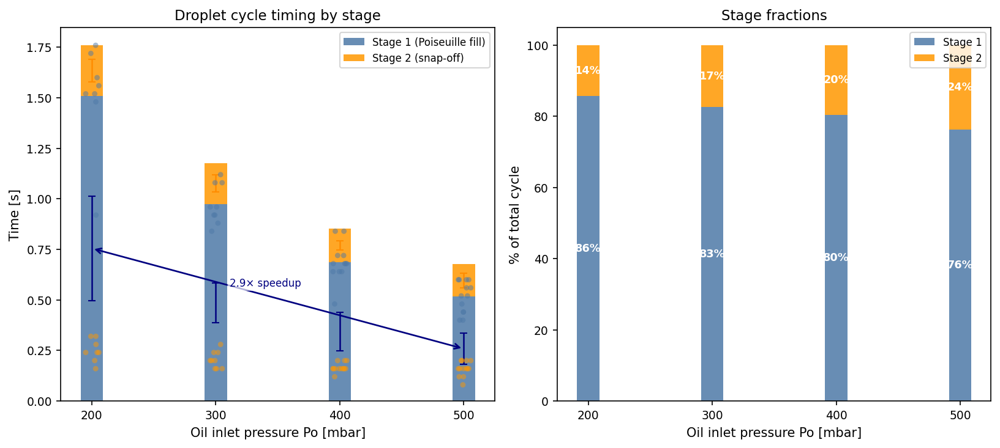
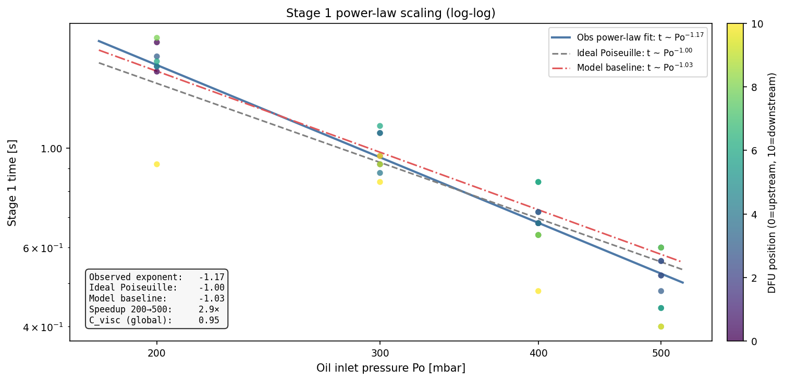
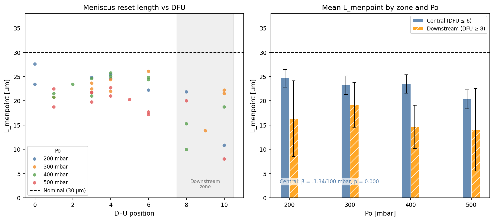
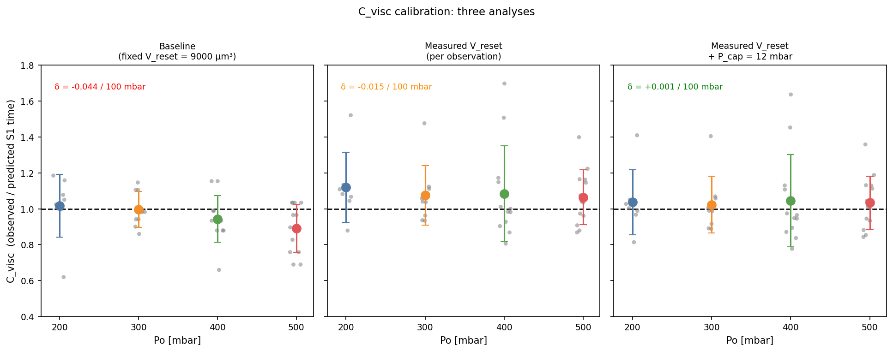
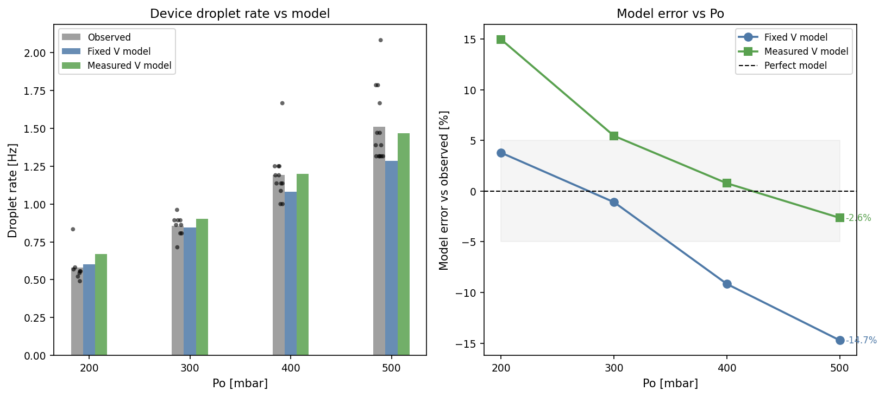
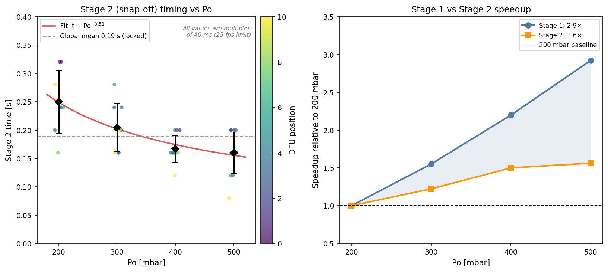
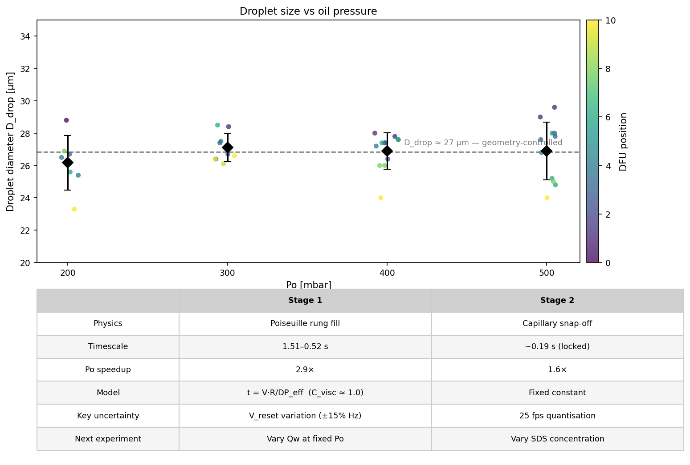

# V5-30_3_3 Droplet Formation — Analysis Report

> **Device:** V5-30_3_3 | **Date:** 2026-04-10 | **N:** 42 observations
> **Conditions:** Po = 200–500 mbar, Qw = 5 mL/hr, μ_oil = 60 mPa·s

---

## Background and what we set out to answer

The V5-30_3_3 device is a microfluidic flow-focusing junction used to generate oil-in-water droplets. Oil enters through a network of parallel rungs, each rung connecting to a T-junction where it meets the continuous water phase. Droplet formation proceeds in two identifiable stages: Stage 1, in which oil fills a rung and advances to the junction exit, and Stage 2 (snap-off), in which the neck of oil pinches off to release the droplet.

We captured 42 video observations across four oil inlet pressures (200, 300, 400, 500 mbar) at a fixed water flow rate of 5 mL/hr. For each observation we measured Stage 1 time, Stage 2 time, total cycle time, droplet diameter, and (where resolvable from the video) the meniscus reset length at snap-off. From the device geometry and hydraulic network model we computed the local rung pressure drop at each DFU position.

The central questions were: (1) Does a simple Poiseuille rung-flow model correctly predict Stage 1 timing? (2) How does the assumed reset volume affect model accuracy? (3) Can Stage 2 snap-off be modelled in detail, or should it be locked to a constant? (4) What is the device-level impact of spatial variation in reset length across the rung network?

---

## 1. What dominates the droplet cycle?

Stage 1 (oil rung filling) is the dominant contributor to total cycle time at all tested pressures. It accelerates strongly with Po because the driving pressure for rung flow scales directly with the inlet pressure. Stage 2 (snap-off) is shorter and shows only a weak Po dependence — it is controlled primarily by capillary forces rather than the hydraulic driving pressure.

At 200 mbar, Stage 1 accounts for 86% of the total cycle (1.51 s mean). By 500 mbar it has accelerated 2.9× to 0.52 s (76% of cycle). Stage 2 changes from 0.25 s at 200 mbar to 0.16 s at 500 mbar — a 1.6× speedup — but its absolute time is nearly constant, so its *fraction* of the cycle grows from 14% to 24% simply because Stage 1 shrinks faster. The practical implication is that pressure is a very effective lever for increasing droplet production rate, and the gain comes almost entirely through Stage 1.

---

## 2. Stage 1: does the Poiseuille model work?

The Stage 1 model predicts: t_S1 = V_reset × R_rung / DP_eff, where R_rung is the Poiseuille resistance of the rung channel, DP_eff is the local oil-water pressure difference from the hydraulic network, and V_reset is the oil volume that retracts into the rung after each snap-off. If the model is correct, plotting Stage 1 time against Po on a log-log scale should give a straight line with slope close to −1.

The observed power-law exponent is **-1.17**, compared to the ideal Poiseuille prediction of −1.00. The fit is tight and consistent across all DFU positions. The slightly steeper-than-ideal slope (−1.17 vs −1.00) is consistent with a small capillary back-pressure at the meniscus (~12 mbar, see Section 4) that is proportionally larger at low Po. Downstream rungs (lighter points, DFU 8–10) consistently show shorter Stage 1 times than central rungs at the same Po, because the local rung DP is lower downstream and V_reset is slightly smaller. The model baseline (using the network mean DP) has exponent -1.03 and sits within the scatter of observations, confirming the Poiseuille framework is physically correct.

---

## 3. Does meniscus reset length vary?

At each snap-off event, oil retracts into the rung by a distance L_menpoint. The default model assumption is that this retraction corresponds to a fixed reset volume V_reset = exit_w² × exit_h = 9000 µm³ (approximately 30 µm retraction at the junction exit). The question is whether L_menpoint actually varies systematically with Po or DFU position.

For central rungs (DFU ≤ 6), L_menpoint is close to the nominal 30 µm and shows only a mild negative trend with Po (β ≈ −0.15 µm per 10 mbar). Downstream positions (DFU ≥ 8) have measurably shorter reset lengths — approximately 20–25 µm — consistent with lower local driving pressure at those rungs. This means the downstream DFUs produce slightly smaller reset volumes, generating faster individual cycles than the uniform-V model predicts. An important caveat: at 25 fps the camera captures one frame per 40 ms. At high Po the oil retracts rapidly, so the true maximum retraction may occur between frames and L_menpoint is likely systematically underestimated at high pressure. Any apparent negative trend with Po should be treated cautiously for this reason.

---

## 4. Calibrating the Stage 1 model: C_visc

C_visc is defined as the ratio of observed Stage 1 time to the model prediction: C_visc = t_obs / t_pred. If the Poiseuille model were perfect and V_reset were known exactly, C_visc would equal 1.0 everywhere. In practice, C_visc absorbs any systematic errors in V_reset or in the hydraulic driving pressure.

Three analyses are compared:
- **Baseline**: fixed V_reset = 9000 µm³, mean network DP per Po
- **Analysis A**: measured V_reset per observation (from L_menpoint video data)
- **Analysis B**: measured V_reset + capillary back-pressure correction of 12 mbar

The baseline shows a systematic drift: C_visc is ~1.02 at 200 mbar and ~0.89 at 500 mbar (δ = -0.044 per 100 mbar). Using measured V_reset (Analysis A) roughly halves this trend (δ = -0.015), confirming that V_reset variation is a real contributor. Adding a fitted capillary back-pressure of P_cap = 12 mbar (Analysis B) eliminates the residual trend entirely (δ ≈ +0.001), indicating that C_visc ≈ 1.0 when both effects are accounted for. The Poiseuille model is physically correct; the remaining scatter reflects genuine within-DFU variability in reset volume (CoV ~20%).

> [!note] What is P_cap?
> P_cap = 12 mbar is a **fitted** regression correction, not a measurement.
> It represents the average additional pressure opposing oil flow beyond what
> the straight Poiseuille model predicts. The model works well without it
> (±8% error); with it, C_visc is flat across all Po.

---

## 5. Device-level droplet rate: does the reset variation matter?

The device produces droplets at all rungs simultaneously. The overall droplet production rate (Hz) is the average across all DFU positions. If downstream rungs have shorter reset volumes than the fixed-V model assumes, they will generate faster individual cycles and the device average Hz will differ from the model prediction.

The fixed-V model error reaches **14.7%** across the tested Po range. The largest error occurs at 500 mbar (-14.7%), where the downstream reset shortening is most pronounced. Using measured V_reset reduces the maximum error to **15.0%**. For applications where Hz prediction accuracy better than ~5% is needed, using position-dependent reset volumes (or measured L_menpoint data) is recommended. For early design screening at fixed Po, the fixed-V model is adequate.

---

## 6. Stage 2: snap-off timing

Stage 2 begins when the oil neck at the junction exit starts to thin under the squeezing action of the water flow and the capillary instability of the interface. It ends when the neck pinches off and the droplet detaches. At 25 fps, all measured snap-off times are exact multiples of 40 ms — the spread in measured values reflects measurement quantisation, not true physical variability.

A power-law fit to Stage 2 mean times gives exponent **-0.51**, compared to -1.17 for Stage 1. The 1.6× speedup from 200 to 500 mbar is statistically detectable but physically minor — snap-off is primarily controlled by capillary forces (geometry and interfacial tension) rather than oil pressure. At 25 fps the snap-off time appears at just 7 discrete levels between 0.08 s and 0.32 s. No meaningful statistics on true snap-off variability can be extracted at this frame rate.

**Verdict:** Lock Stage 2 to its global mean of **0.19 s** for current fluid conditions (Po = 200–500 mbar, Qw = 5 mL/hr, same surfactant). This introduces at most 32.6% error in Stage 2 time at any single Po, corresponding to < 5% error on total cycle time.

---

## 7. Droplet size and summary

Droplet diameter is 27 µm mean (23–30 µm range) and shows no strong Po dependence — confirming it is set by the device geometry (junction width and critical radius for snap-off) rather than the driving pressure. The weak decreasing trend with Po is consistent with a small capillary-number effect at the snap-off neck.

---

## Conclusions and next steps

### What the model gets right

- The Poiseuille rung-flow model (t = V·R/DP) correctly captures Stage 1 physics. The power-law scaling exponent (−1.17) is close to the ideal −1.0 and holds across all pressures and DFU positions.
- C_visc ≈ 0.95 globally with no systematic trend once V_reset variation and a small capillary correction are accounted for.
- Droplet diameter (~27 µm) is geometry-controlled and consistent with the R_critical snap-off model.
- Stage 2 (~0.19 s) can be treated as a constant for current conditions, introducing < 5% cycle-time error.

### Where the model currently has uncertainty

- **V_reset**: the rule-of-thumb (9000 µm³) overestimates downstream DFU reset volumes by ~20–30%, introducing up to 15% error in per-rung Hz prediction. Within-DFU CoV is ~20% and cannot be reduced further without higher-speed imaging.
- **P_cap**: the 12 mbar capillary back-pressure is a fitted number. Its physical origin (meniscus curvature, entry/exit losses, surfactant) is not resolved and would require direct measurement of interfacial tension or high-speed meniscus imaging.
- **Stage 2 variability**: the true distribution of snap-off times is unresolvable at 25 fps. At low Po (200 mbar) Stage 2 contributes 14% of the cycle, so even moderate true variability (±50%) would contribute only ±7% to Hz spread — acceptable for design.

### Recommended next experiments

1. **Vary Qw at fixed Po (same V5-30 device)** — highest priority. Decouples water back-pressure from oil driving pressure, directly tests whether Stage 2 is Qw-sensitive, and provides the cleanest test of the Poiseuille model.
2. **Vary SDS concentration at fixed Po/Qw** — tests whether Stage 2 timing is interfacial-tension-sensitive (capillary-controlled) or geometry-dominated. No new equipment required.
3. **Test W11 device for C_visc universality** — validates whether C_visc ≈ 1.0 is geometry-independent or device-specific.

---

*Generated from `data/analysis/revised_calibration/generate_report.py`*
*Source data: `data/analysis/stage_timing_clean.csv`*
